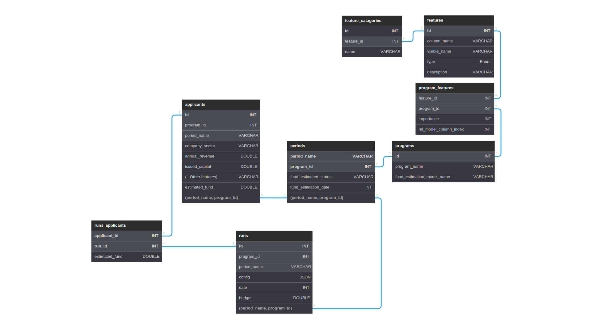

  
  
  <strong>Fund Management System</strong>

## 🌐 Info

Tamkeen Fund Management System (TFMS) is serverless machine learning-based application that consists of two interfaces:

The Public Support Calculator that is designed to help individuals and business owners estimate and predict the amount of support and funds that they or their businesses could be eligible for before applying to a program in Tamkeen.

The Private Fund Distributor, which is designed to reduce the amount of manual work needed for Tamkeen employees to estimate and distribute the allocated budget to the eligible applicants. They will have access to an intuitive, fast, and easy-to-use dashboard and a distribution wizard that will allow them to do all the steps necessary to rank the applicants based on their impact and the features that they can define and adjust using slides and knobs, along with multiple helpful charts that update in real-time to give the Tamkeen employees a better understanding of the budget distribution among the different applicants and features.

 

<!-- # 📦 Components -->
<!-- # 🗺️ Diagrams -->

## 🏗️ Architecture Diagram

  

## 🛢 Database Diagram

  
  
## 🧮 Support Calculator

+ Fast and Easy-to-use Machine Learning-based Fund Estimator

  [Support Calculator](https://user-images.githubusercontent.com/41854795/226639443-cae645d3-cdc0-4bdd-8f2e-b4d4804c4c51.webm)
  
## 📊 Fund Distributor

+ Secure and Scalable User Authentication using AWS [Cognito](https://aws.amazon.com/cognito)

  [Login](https://user-images.githubusercontent.com/41854795/226643066-0b9d75f2-4145-43bc-8e0b-5464ce216362.webm)

+ Asynchronous (Non-Blocking) Page Translation using React [I18next](https://react.i18next.com)

  [Translation](https://user-images.githubusercontent.com/41854795/226638802-369a4286-ece6-4c49-871f-12d02c9b58eb.webm)
  
+ Highly Scalable and Parallel Fund Estimation using AWS [Lambda](https://aws.amazon.com/lambda)

  [Parallel Fund Estimation](https://user-images.githubusercontent.com/41854795/226638893-98c5ee9c-7f3a-4674-aff8-0c19c17cd7c0.webm)
  
+ Interactive and User-Friendly Charts using React [ApexCharts](https://apexcharts.com/docs/react-charts)

  [Charts](https://user-images.githubusercontent.com/41854795/226639049-f1fcb921-e6ab-420f-8e92-816840f8fb7b.webm)
  
+ Super Fast, Searchable, Sortable Applicants Table using React [MDB 5](https://mdbootstrap.com)

  [Applicants Table](https://user-images.githubusercontent.com/41854795/226639154-2b081ec7-1802-4c35-8d2f-58bb8353056b.webm)
  
+ Asynchronous Configuration Saving, Loading and Global State Management using React [Redux](https://react-redux.js.org/)

  [Applicants Table](https://user-images.githubusercontent.com/41854795/226640123-0ae5a52c-f421-4cfd-b66d-5d594721fd81.webm)
  
 
  
## ⚡️ Technologies used

+ ### AWS

  + [SageMaker](https://aws.amazon.com/sagemaker)

  + [Aurora](https://aws.amazon.com/aurora)

  + [S3](https://aws.amazon.com/s3)
  + [Lambda](https://aws.amazon.com/lambda)
  + [API Gateway](https://aws.amazon.com/api-gateway)

  + [Cognito](https://aws.amazon.com/cognito)

  + [CloudFront](https://aws.amazon.com/cloudFront)
  + [Route 53](https://aws.amazon.com/route53)

  + [CodePipeline](https://aws.amazon.com/codepipeline)
  + [CodeBuild](https://aws.amazon.com/codebuild)
  + [CodeDeploy](https://aws.amazon.com/codedeploy)

  + [EC2](https://aws.amazon.com/ec2)

  + [VPC](https://aws.amazon.com/vpc)

  + [CloudShell](https://aws.amazon.com/cloudshell)

  + [CloudWatch](https://aws.amazon.com/cloudwatch)

+ ### React

  + [Redux](https://redux.js.org)
  + [Redux-Saga](https://redux-saga.js.org)
  + [I18next](https://react.i18next.com)
  + [ApexCharts](https://apexcharts.com/)
  + [MDB 5](https://mdbootstrap.com)

+ ### Tools

  + [VSCode](https://code.visualstudio.com)
  + [AWS CLI](https://aws.amazon.com/cli)
  + [Git](https://git-scm.com)
  + [GitHub](https://github.com)
  + [MySQL Workbench](https://www.mysql.com/products/workbench)
  + [Postman](https://www.getpostman.com)
  + [Slack](https://slack.com)
